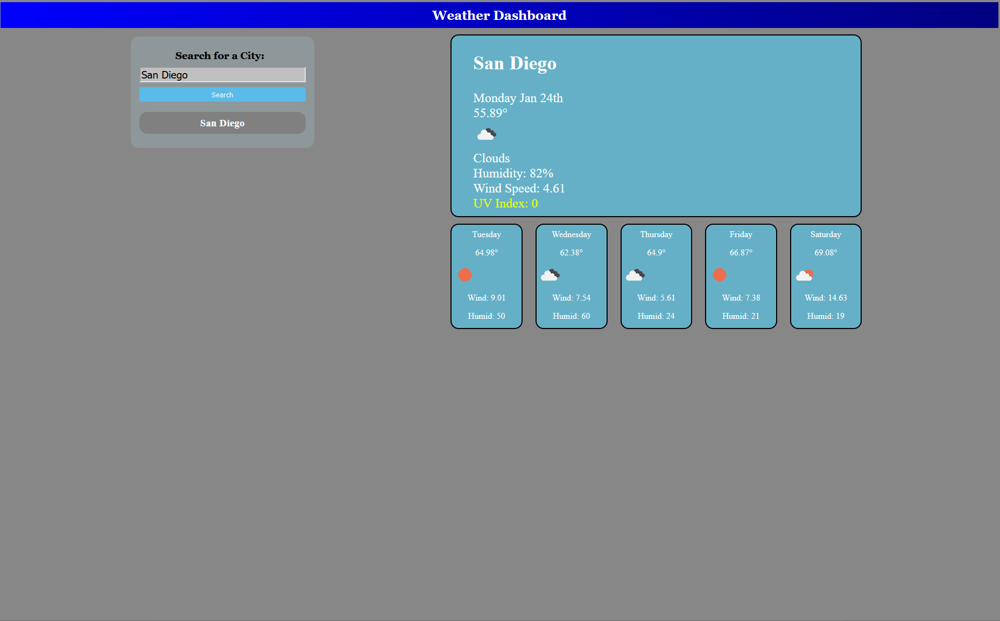

## Weather Dashboard

This website will take any city you type into the text, and pull weather infomration such as Temperature (in Fahrenheit), clear/cloudy skies, humidity, wind speed, and UV.

It will also display the 5-day forecast for that city under today's information. 

Every search generates a history bubble. Clicking one of these bubbles will re-search that city.

html found here: https://seyaryu.github.io/1-25-Homework/
